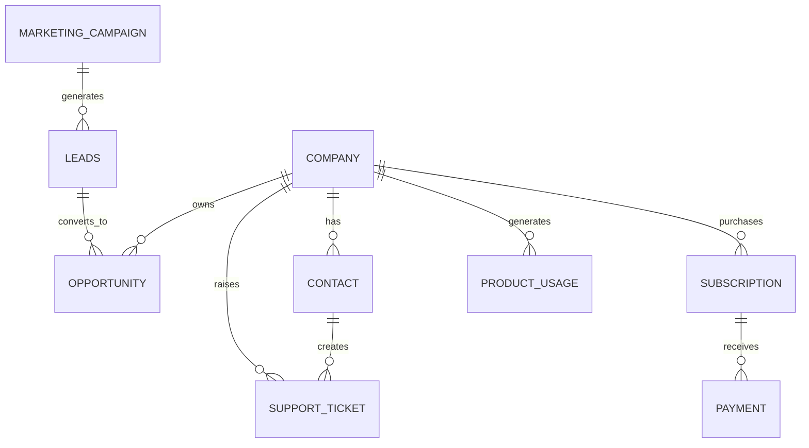

```mermaid
erDiagram

    MARKETING_CAMPAIGN ||--o{ LEADS : generates
    LEADS ||--o{ OPPORTUNITY : converts_to

    COMPANY ||--o{ CONTACT : has
    COMPANY ||--o{ OPPORTUNITY : owns
    COMPANY ||--o{ SUBSCRIPTION : purchases
    COMPANY ||--o{ PRODUCT_USAGE : generates
    COMPANY ||--o{ SUPPORT_TICKET : raises

    SUBSCRIPTION ||--o{ PAYMENT : receives

    CONTACT ||--o{ SUPPORT_TICKET : creates
```

    
